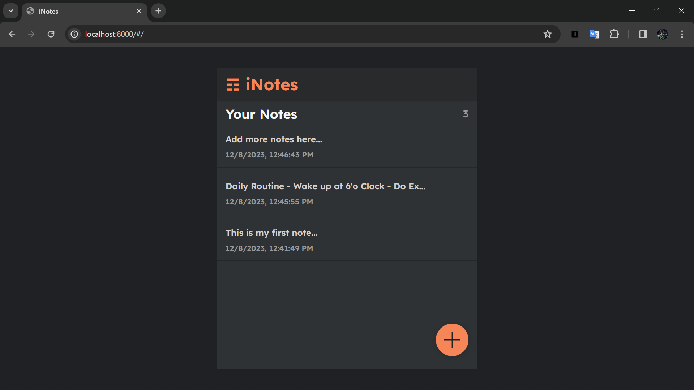

# iNotes Application

## About
This is a Notes Application Project. Here one can create his notes and keep them updated or delete them. 

Its backend is based upon **Django Framework** and frontend is of **React Js**. The frontend part of React Js is integrated within the Django.
For creating APIs, Django Rest Framwork(DRF) and Object Relational Mapping(ORM) is used to implement 'GET', 'POST', 'PUT', 'DELETE' methods.

## Commands to run after dwonloading project :

### Prerequisite- Python3 

### - Create virtual Environment
> python -m venv venv

### - Activate Virtual Environment
> venv/Scripts/activate

### - Install Requirements
> pip install -r requirements.txt

### - Start Project
> python manage.py runserver

### Website Preview

